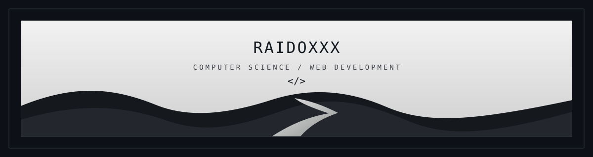

 

  

---

<h2 align="center">About me</h2>

Computer Science student from Brazil focused on web development, backend systems and APIs. 
I like turning ideas into real projects and improving them through practice, iteration and consistency.

<code>Computer Science</code>&nbsp;&nbsp;
<code>Backend</code>&nbsp;&nbsp;
<code>APIs</code>&nbsp;&nbsp;
<code>Web Development</code>&nbsp;&nbsp;
<code>Software Projects</code>

---

<h2 align="center">Technologies</h2>

---

<h2 align="center">Projects</h2>

  

---

<h2 align="center">Statistics</h2>

 

---

<h2 align="center">Contribution</h2>

---

Code. Build. Improve.

