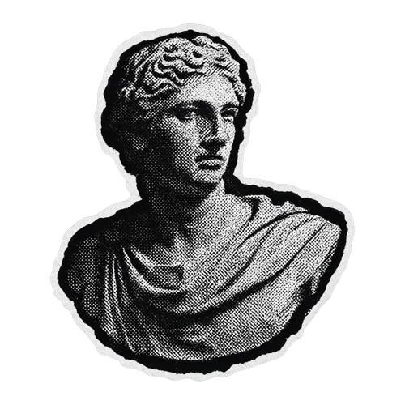

 

# Raidoxxx

### Computer Science · Backend · APIs · Web Development

  I turn ideas into working software — learning, building and improving one project at a time.

 

<h2 align="center">Know About Me</h2>

<h3>Hey there! I'm Raidoxxx.</h3>

  I'm a Computer Science student from Brazil focused on web development,
  backend systems and APIs. I enjoy turning ideas into real projects and
  refining them through practice, iteration and consistency.

  My goal is simple: understand how things work, build useful software and
  become a better developer with every commit.

 

 

<h2 align="center">Technologies & Tools</h2>

 

 

<h2 align="center">Top Projects</h2>

<h3><a href="https://github.com/Raidoxxx/cineflow-front">Cineflow Front</a></h3>

A frontend project built around a cinema experience.

<h3><a href="https://github.com/Raidoxxx/intranet">Intranet</a></h3>

A web application focused on an internal workspace.

<h3><a href="https://github.com/Raidoxxx/PanicBot">PanicBot</a></h3>

A JavaScript bot built for the Panic Community.

 

 

<h2 align="center">Connect</h2>

  

> Code is never finished. It only becomes slightly better over time.

Every commit is one more step forward.

 

<h2 align="center">GitHub Overview</h2>

 

<h2 align="center">Contribution</h2>

 

Code · Build · Improve

